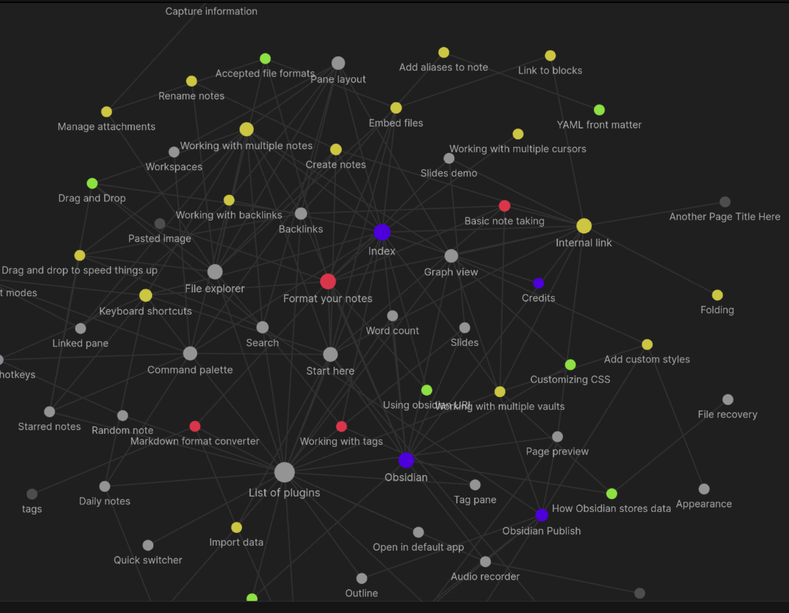

# Пет проект по созданию абстрактной жизни
#### Основная идея данного проекта это получение опыта работы со Spring-ом и БД. Суть проекта это представление жизни человека в цифровом мире.
    
    Персонаж: Это вы, то есть обычный человек.

У каждого персонажа может быть питомец, который привязывается к персонажу.

    Питомец: Домашнее животное, собака/кот/черепаха/панда. 
    Да это странно, что панда тут как домашнее животное,
    но вдруг вы живете в частном доме, где нибудь в китае.

Также возможна реализация семейных отношений.

    Жена/Муж: Человек с которым вы связаны с другого устройства, 
    либо же вымышленное создание
    Дети: Человек/Люди с другого(-их) устройства(-тв), связанные 
    с вами, как с родителем.

Связь со всеми сущностями будет реализована в виде графа.

Вот такая большая семья может, получится у вас:

Каждый член семьи может ставить свои реакции настроения, после чего 
всем будет приходит уведомление о состоянии этого человека, то есть 
если кому то станет грустно, об этом могут узнать все.

###### Возможно это станет игрой в виде кликкера, чтобы за клик зарабатывать деньги и покупать животных (Жену/Мужа).